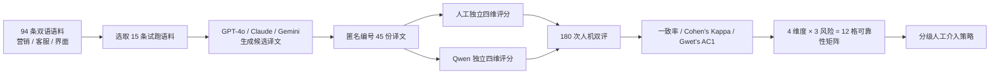

# 大模型译文审校可靠性评测

> 面向营销、客服与界面文案的译后审校场景，基于人机双评量化大模型在不同质量维度与内容风险下的可靠性边界，并将评测证据转化为分级人工介入策略，为后续审校 Agent 的自动化权限设计提供依据。


**[在线看板 ↗](https://curious-leila.github.io/leila-evalboard/)** · **[查看源码 ↗](https://github.com/curious-leila/leila-evalboard)**

---


## 30 秒了解项目

直接把大模型用于译文审校，会遇到一个比“平均准确率够不够高”更重要的问题：

> **哪些判断可以交给模型，哪些判断必须保留人工介入？**

本项目基于多维质量指标（MQM）裁剪出术语一致性、准确性、本地化规范、受众适配性 4 个质量维度，构建营销、客服、界面文案三类 94 条双语语料，并从中选取 15 条试跑语料，由 GPT-4o、Claude、Gemini 生成 45 份匿名候选译文。

人工与 Qwen 按同一套四维评分标准独立评价，共形成 **180 次人机双评**。整体直接一致率为 **95%**，Gwet 一致性系数（Gwet's AC1）为 **0.947**；但拆分到“质量维度 × 内容风险”后，**术语一致性 × 高风险**组合仅为 **11/18（61%）**，成为唯一低于 90% 的组合。

因此，本项目没有停留在“模型评分表现不错”的结论，而是进一步将 12 格可靠性结果映射为分级人工介入策略，并作为后续审校 Agent 可靠性策略的设计依据。

### 项目信息


| 项目维度 | 说明                                             |
| ---- | ---------------------------------------------- |
| 项目类型 | 大模型译文审校可靠性评测 / AI 产品作品集项目                      |
| 我的角色 | AI 产品经理、评测设计、产品策略                              |
| 负责范围 | 独立完成评测框架、语料构建、人工评分、AI 评分流程、统计分析、分歧复核、策略映射与评测看板 |
| 内容场景 | 营销文案、客服话术、界面文案                                 |
| 语言方向 | 英文 → 简体中文                                      |
| 数据规模 | 94 条双语语料；15 条进入试跑；45 份候选译文；180 次人机双评           |
| 当前状态 | 评测数据已冻结；公开看板可访问                                |


---


## 问题定义

传统“模型准确率”只能告诉我们整体表现，却无法直接回答产品真正需要做的权限决策。

本项目重点解决四个问题：

- **平均值掩盖局部风险**：整体一致率很高，不代表所有质量维度、所有业务风险下都可以自动放行。
- **模型可能无依据地自信判断**：尤其在术语问题上，模型会把“看起来合理”误当作“存在官方依据”。
- **人工也不是绝对真值**：部分样本中，AI 发现了人工首评遗漏的问题，必须通过外部证据复核后再确认。
- **评测结果需要转化为产品动作**：评测终点不是一个更漂亮的分数，而是决定模型可以被授予多大的自动化权限。

因此，项目目标被定义为：

> **用人机一致性证据识别大模型审校能力边界，并把“可靠性差异”转化为可执行的人工介入策略。**

---


## 评测方案


### 1. 评测框架

基于多维质量指标（MQM）并结合出海内容场景，选取 4 个质量维度：


| 质量维度  | 核心问题                         |
| ----- | ---------------------------- |
| 术语一致性 | 专有名词、品牌词、功能名、行业术语是否准确且符合既有规范 |
| 准确性   | 译文是否完整、准确传达原文命题内容            |
| 本地化规范 | 数字、货币、日期、时间、单位等是否符合目标地区惯例    |
| 受众适配性 | 表达是否适合目标受众与目标文化语境            |


严重度采用四级体系：

`无问题（Neutral） → 轻微（Minor） → 严重（Major） → 极严重（Critical）`

同时，在翻译生成前仅依据源文和业务场景标注内容风险：

`高风险（High） / 中风险（Medium） / 低风险（Low）`

**内容风险回答“如果翻错，后果多严重”；严重度回答“这条译文实际错得多严重”。两者独立，不混为一个指标。**

### 2. 评分流程




生成模型与评分模型角色分离，避免让生成方直接评价自己的译文。

[查看完整评测方法 ↗](docs/evaluation-methodology.md) · [查看四维评分 Prompt ↗](docs/prompts/)

---


## 核心结果


### 1. 整体人机一致性


| 指标            | 结果        |
| ------------- | --------- |
| 人机双评次数        | **180**   |
| 整体直接一致率       | **95.0%** |
| Cohen's Kappa | **0.734** |
| Gwet's AC1    | **0.947** |


整体结果看起来已经较高，但进一步拆分后出现了明显的局部可靠性差异。

### 2. 十二格可靠性矩阵


| 质量维度      | 高风险            | 中风险            | 低风险       |
| --------- | -------------- | -------------- | --------- |
| **术语一致性** | **61%（11/18）** | 100%（18/18）    | 100%（9/9） |
| **准确性**   | **94%（17/18）** | 100%（18/18）    | 100%（9/9） |
| **本地化规范** | 100%（18/18）    | **94%（17/18）** | 100%（9/9） |
| **受众适配性** | 100%（18/18）    | 100%（18/18）    | 100%（9/9） |


核心发现：

> **整体高一致 ≠ 所有场景都适合自动放行。**

其中“术语一致性 × 高风险”是唯一低于 90% 的组合，18 次判断中出现 7 次分歧，说明高风险术语判断需要显著更严格的人工与证据约束。

[查看人机一致性报告 ↗](docs/consistency-report.md) · [查看可靠性矩阵 ↗](docs/reliability-matrix.md)

---


## 分歧案例：模型和人工分别会错在哪里

仅看一致率无法解释产品应该怎么改，因此对全部分歧样本进行逐条复核，并在需要时引入外部事实证据。

### AI 过度宽松：6 次

两组代表性问题集中在高风险术语：

- **S061 / S065 / S069：claim**
  - AI 对“申诉 / 索赔”等译法给出过于宽松判断；
  - 外部核查后，PayPal 简体中文材料中的对应规范用法为“补偿申请”。
- **S121 / S125 / S129：Kick**
  - AI 将“踢出 / 踢”视为标准或可接受译法，或低估其偏离程度；
  - 对照中文通讯与协作产品的实际界面用法后，人工维持“移出 / 移除”更符合专业软件语境的判断。

这组 Bad Case 暴露出：

> **模型可以检索或提出候选判断，但不能仅凭内部知识自行声明“官方译法”并据此放行。**


### AI 抓回人工漏检：3 次

S077 / S081 / S084 围绕“发送退款”这一表达：

- 人工首评未识别异常；
- AI 判为轻微问题；
- 进一步外部核查发现 PayPal 使用“发放退款”、支付宝使用“发起退款”、微信支付使用“申请退款”；
- 3 条人工评分最终均采纳证据后修订。

这组案例说明：

> **Human 也不天然等于绝对真值；人工判断、模型判断和外部证据需要形成可复核的关系。**

[查看完整分歧复核记录 ↗](docs/diff-review.md) · [查看 Prompt 迭代记录 ↗](docs/prompt-iteration.md)

---


## 从评测结果到分流策略

本项目不把 12 格矩阵停留在报告层，而是将其映射为试跑阶段的三级人工介入策略：


| 可靠性组合                      | 试跑阶段策略        | 人工介入     |
| -------------------------- | ------------- | -------- |
| 术语一致性 × 高风险（61%）           | 强制人工          | **100%** |
| 准确性 × 高风险、本地化规范 × 中风险（94%） | 模型判断 + 抽样复核   | **10%**  |
| 其余 9 个样本内 100% 一致组合        | 模型自动评分 + 抽检兜底 | **5%**   |


按上述规则进行离线策略推演：

> **人工介入量 = 28 / 180 = 15.5%**

**事实边界：15.5% 是基于本次试跑一致率的离线策略推演，只用于比较不同分流规则下的人工介入规模，不代表线上业务收益，也不是生产环境人工复核率预测。**

这套试跑策略随后成为审校 Agent 可靠性策略（Reliability Policy）的设计输入。后续 Agent 不再机械复制静态矩阵，而是进一步结合当前质量判断、证据状态和失败降级条件，决定自动通过、抽样复核或人工复核。

---


## 关键产品决策


| 产品问题                | 我的判断           | 解决方案                                    |
| ------------------- | -------------- | --------------------------------------- |
| 整体一致率高，是否可以统一自动放行   | 平均值会掩盖局部高风险    | 将“4 个质量维度 × 3 档内容风险”拆成 12 格分别评估         |
| 内容风险和译文错误严重度容易混淆    | 两者回答的是不同问题     | Risk 在译前按源文标注；Severity 在译后按实际错误评分       |
| 模型会自信声明“官方译法”       | 语言合理性不等于事实成立   | 对术语分歧引入外部证据复核，并沉淀为后续 Agent 的证据需求        |
| 人工评分能否直接当作绝对真值      | 人工同样可能漏检       | 保留分歧仲裁与证据改判机制，记录人工修订原因                  |
| 样本内 100% 一致是否意味着零风险 | 小样本满分不能外推为永不犯错 | Pilot 阶段仍保留 5% 抽检兜底                     |
| Eval 做完以后如何进入产品     | 评测价值在于改变自动化权限  | 将可靠性矩阵映射为分级人工介入策略，并作为后续 Agent Policy 输入 |


---


## 证据链与可审计性

公开看板只负责让读者快速理解结论；完整方法、评分标准、分歧案例和数据口径保留在仓库中，形成“结论 → 方法 → 原始判断 → 策略”的可追溯证据链。


| 证据材料                                          | 回答的问题                   |
| --------------------------------------------- | ----------------------- |
| [评测方法与评分框架](docs/evaluation-methodology.md)   | 为什么选这 4 个维度？严重度和风险如何定义？ |
| [术语一致性评分 Prompt](docs/prompts/terminology.md) | AI 如何判断术语问题？            |
| [准确性评分 Prompt](docs/prompts/accuracy.md)      | AI 如何判断命题准确性？           |
| [本地化规范评分 Prompt](docs/prompts/locale.md)      | AI 如何判断数字、日期、格式问题？      |
| [受众适配性评分 Prompt](docs/prompts/audience.md)    | AI 如何判断文化与受众适配问题？       |
| [Prompt 迭代记录](docs/prompt-iteration.md)       | Bad Case 如何驱动评分标准迭代？    |
| [人机一致性报告](docs/consistency-report.md)         | 180 次双评的统计结果是什么？        |
| [分歧案例复核记录](docs/diff-review.md)               | 具体哪些案例发生分歧？最终依据是什么？     |
| [可靠性矩阵与策略映射](docs/reliability-matrix.md)      | 12 格结果如何转化为人工介入策略？      |
| [公开评测数据说明](data/README.md)                    | 公开数据包含哪些字段、如何理解？        |
| [公开评测结果](data/evaluation-results.csv)         | 是否可以独立复核核心一致率结果？        |


---


## 数据与事实边界

为了避免把 Pilot 结果包装成生产结论，本项目明确保留以下边界：

- **94 条语料 ≠ 94 条全部进入双评**：94 条完成语料构建、风险标注和来源记录，其中 15 条进入正式 Pilot。
- **180 次判断 = 15 条语料 × 3 款候选译文 × 4 个质量维度**。
- **100% 一致率是本次样本内结果**，不等于模型在真实生产环境“完全可信”。
- **15.5% 是离线策略推演**，不是线上实测降本结果。
- 本次评测结论仅对当前英文 → 简体中文、当前语料结构和评分标准具有直接证据支持，不未经重新评测外推到其他语言方向或业务场景。

---


## 项目结构

```text
.
├── README.md
├── index.html                         # 评测看板
├── docs/
│   ├── evaluation-methodology.md      # 评测方法与评分框架
│   ├── prompt-iteration.md            # Prompt Bad Case 迭代记录
│   ├── consistency-report.md          # 180 次人机双评统计
│   ├── diff-review.md                 # 完整分歧案例复核
│   ├── reliability-matrix.md          # 12 格矩阵与策略映射
│   └── prompts/
│       ├── terminology.md
│       ├── accuracy.md
│       ├── locale.md
│       └── audience.md
└── data/
    ├── README.md                      # 数据字段与事实边界
    └── evaluation-results.csv         # 公开版评测结果
```

---


## 延伸阅读

- [评测方法与评分框架](docs/evaluation-methodology.md)
- [Prompt 迭代记录](docs/prompt-iteration.md)
- [人机一致性报告](docs/consistency-report.md)
- [完整分歧案例复核](docs/diff-review.md)
- [可靠性矩阵与策略映射](docs/reliability-matrix.md)
- [公开评测数据](data/evaluation-results.csv)

---


## 项目说明

本项目是用于展示 AI 产品评测、可靠性分析与自动化权限设计能力的独立作品集项目。

评测结果来自 2026 年 7–8 月冻结的 Pilot 数据。所有公开结论均按当前样本和方法口径表述，不将离线推演包装为线上业务收益，也不将样本内一致率外推为模型在生产环境中的绝对能力。

后续审校 Agent 项目在本项目的可靠性证据基础上，进一步加入证据查证、规则治理、失败降级和最终分流机制，将静态评测结论转化为运行时自动化权限。